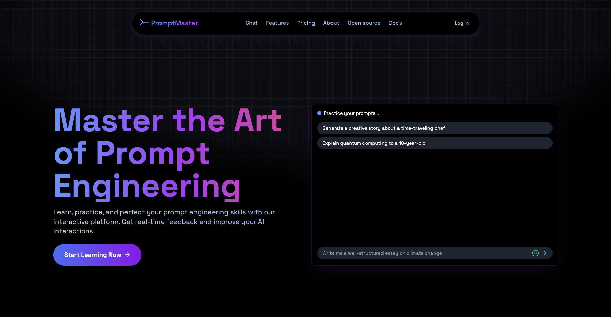

# 🧠 Prompt Engineering Learning Path 🚀



[](https://vercel.com/new/clone?repository-url=https://github.com/duplixx/promptr)

Welcome to the most mind-bending, AI-whispering, prompt-perfecting learning experience this side of the singularity!

## 🌟 What's This All About?

Ever wanted to sweet-talk an AI? Well, you've come to the right place! Our Prompt Engineering Learning Path is like a gym for your AI communication skills. By the end, you'll be flexing those prompt muscles and making ChatGPT blush!

## 🎯 Features

- 🤖 Interactive ChatGPT-style interface (minus the existential crisis)
- 🧩 15 modules covering everything from "Hello, AI" to "Inception-level prompt inception"
- 🏋️‍♀️ Hands-on labs (No, you can't ask the AI to do them for you)
- 🌈 Beginner to Advanced paths (From "What's a prompt?" to "I am become prompt, destroyer of writer's block")
- 🎭 Role-playing exercises (Pretend you're Shakespeare asking GPT-4 for gardening tips)

## 🚀 Quick Start

1. Clone this repo (Time travel not included)
2. Install dependencies:
   ```
   npm install
   # or
   yarn install
   # or
   pnpm install
   ```
3. Run the development server:
   ```
   npm run dev
   # or
   yarn dev
   # or
   pnpm dev
   ```
4. Open [http://localhost:3000](http://localhost:3000) and start your journey to prompt mastery!

## 🗺️ Learning Path

1. **Beginner**: Learn to crawl (AI-assisted, of course)
2. **Intermediate**: Walk amongst the prompts
3. **Advanced**: Run circles around those pesky AI models
4. **God Mode**: Achieve prompt enlightenment (Disclaimer: May cause spontaneous haiku generation)

## 🛠️ Tech Stack

- [Next.js](https://nextjs.org/) - Because we're living in the future
- [React](https://reactjs.org/) - For UI wizardry
- [shadcn/ui](https://ui.shadcn.com/) - Making things pretty (and accessible!)
- [TypeScript](https://www.typescriptlang.org/) - For those who like their types static and their errors caught early

- [FastApi](https://fastapi.tiangolo.com/) - Driving our high-performance Python backend with modern async capabilities

## 🚀 Deployment

### Deploy to Vercel (Recommended)

The easiest way to deploy this Next.js app is to use [Vercel](https://vercel.com):

1. **Push your code to GitHub** (if you haven't already)

2. **Import your repository to Vercel:**
   - Go to [vercel.com/new](https://vercel.com/new)
   - Import your GitHub repository
   - Vercel will automatically detect Next.js

3. **Configure Environment Variables:**
   Add the following environment variables in your Vercel project settings:
   ```
   DATABASE_URL=your_mongodb_connection_string
   GOOGLE_GENERATIVE_AI_API_KEY=your_gemini_api_key
   NEXTAUTH_SECRET=your_nextauth_secret (generate with: openssl rand -base64 32)
   NEXTAUTH_URL=https://your-deployment-url.vercel.app
   ```

4. **Deploy!**
   - Click "Deploy"
   - Vercel will build and deploy your application
   - Your app will be live at `https://your-project.vercel.app`

### Deploy to Other Platforms

#### Netlify
1. Connect your repository to Netlify
2. Set build command: `npm run build`
3. Set publish directory: `.next`
4. Add the same environment variables as above

#### Docker
1. Build the Docker image:
   ```bash
   docker build -t promptr .
   ```
2. Run the container:
   ```bash
   docker run -p 3000:3000 -e DATABASE_URL=your_mongodb_url promptr
   ```

### Environment Variables

Make sure to set these environment variables in your deployment platform:

| Variable | Description | Required |
|----------|-------------|----------|
| `DATABASE_URL` | MongoDB connection string | Yes |
| `GOOGLE_GENERATIVE_AI_API_KEY` | Google Gemini API key for AI features | Yes |
| `NEXTAUTH_SECRET` | Secret for NextAuth.js (generate with `openssl rand -base64 32`) | Yes |
| `NEXTAUTH_URL` | Your deployed app URL | Yes (production only) |

## 🤝 Contributing

Found a bug? Want to add a feature? Have a prompt so good it made your AI assistant giggle? We welcome contributions! Check out our [CONTRIBUTING.md](CONTRIBUTING.md) for guidelines.

Remember: With great prompt comes great responsibility!

## 📜 License

This project is licensed under the MIT License - see the [LICENSE.md](LICENSE.md) file for details. (No, you can't prompt the AI to change the license terms)

## 🙏 Acknowledgments

- Gemini, for making us believe in the power of language models (and occasionally doubt our own existence)
- Coffee, for fueling late-night prompt engineering sessions
- Our AI overlords, for their benevolence in allowing us to create this project

Now go forth and prompt like you've never prompted before! May your tokens be plentiful and your hallucinations be minimal. Happy learning! 🎉
